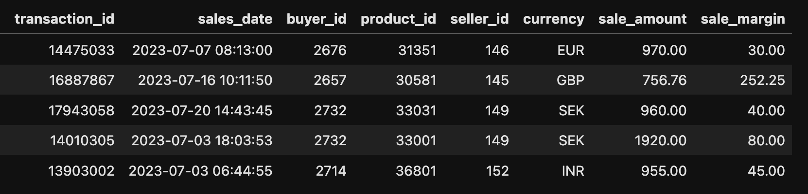
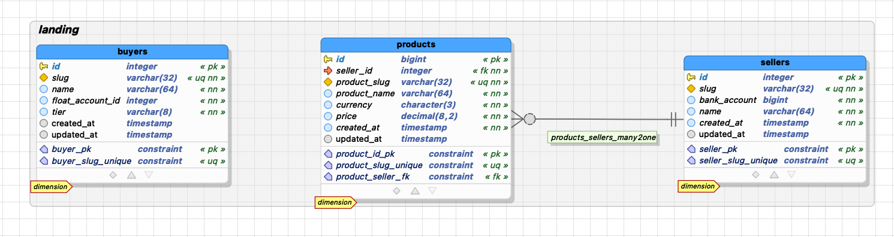

# Tillo Technical Test
## Data Engineer

Thank you for applying to our open role for a data engineer at Tillo.

You have passed through our filters and are over the first hurdle. Now we would like to invite you to an interview with the hiring managers of your prospective future role. 

### Our location
- Tillo's Brighton and Hove Office at:
    + Hove Business Centre
    + Unit 11
    + Hove, UK, BN3 6HA
- See map: https://maps.app.goo.gl/rnTsqomSrjwfWc2m8

## The interview
In the upcoming interview, we would like to get to know you and ascertain your technical strengths and weaknesses as they pertain to this role. To help us achieve that, we have prepared a simple technical challenge (see below) for you to apply your skills at. Please take a look at it and come prepared to discuss it at the interview. You will also have a chance to ask us any questions you may have.

First note:

- This challenge exemplifies the sort of tasks you would be expected to perform in the role. If you like solving the challenge, you're going to love the work.
- As you tackle it, we would like to encourage you to think of the environment around the task as well: for example, what other components, processes, and technologies need to exist around this project to make your solutions production-ready? What concerns might you have about your in the production context?
- Don't fret about finding the "ultimate best" solution. We don't believe there is a "one, true solution" to this challenge. There are many ways to achieve its aims, and each has their strengths. We only need to see the one you can come up with and your reasoning for choosing it.
- In the interview, we will be awarding bonus points for acknowledging any known weaknesses and drawbacks you can see with your own solution, as well as making any assumptions made along the way explicit.
- It is expected that your solution is rough and unpolished. Please don't spend your time on trying to refine every nook and cranny. We can discuss your ideas for improvements in the interview.


---
## The challenge
There are two parts to the challenge. The **first and most important** part is to *build a data pipeline* from two data sources into an analytical data warehouse. The second part, is about *analytical reporting* performed on the loaded data. We don't anticipate that this task will take very long to complete

### Part 1: ETL

The first data source is the transactional engine of Tillo's marketplace application. An export process (out of scope) delivers deltas in the form of CSV files exported daily from the transactional system into an AWS S3 bucket. The files contain details of sale transactions. An example file is included in this package. Sales data include:

- the transaction id
- the transaction timestamp
- the buyer's id
- the product's id
- the seller's id 
- the currency code
- the sale cost
- the seller margin,



The second data source is our exchange rate service which provides daily currency exchange rates. We use this service to collect rates for converting monetary values from the many currencies used in our transactional engine to GBP. The service provides an API for retrieving these rates in JSON format, which we run on a daily schedule. Their API endpoint takes as input the base currency code and a date. Our base currency is 'GBP'. The retrieved JSON looks like the following:

```
    {
        "base": GBP,
        "date": "2023-07-01",
        "rates": {
            "GBP":1.0000
            "EUR":0.9066
            "USD":0.8000
            ...
        }
    }
```

Data from both these sources must be loaded into an analytical data warehouse system which is a relational database with a standard SQL interface. That database already contains, among others, these dimension tables:

- `buyers`
- `sellers`
- `products`

Each *seller* can sell multiple *products* and each *buyer* can purchase any *product* from any *seller*. See the schema diagram below. You can also get a sense of the scheme by reading through the accompanying data definition language (DDL) script (`sql/sales_db_ddl.sql`)



Data from both the external sources described above must be loaded on a daily basis into this database.

#### Task-to-be-done:
1. Discuss: How would you build data pipelines from these two sources to _routineley_ and _automatically_ ingest sales CSV and exchange rate JSON data into the relational database?
2. Design: Please build relational tables for daily sales and the daily rates data ingested into the data warehouse.

---

### Part 2: Reports
Our commercial team monitors the sales on our platform. They have requested two reports to be produced to ease their task.

The first report must be generated daily, with all transactions for each *buyer*, *seller* combination. All monetary values must be converted to our base currency (GBP) and summed up. Each record of the report should contain:

- the date
- the seller display name
- the buyer display name
- the number of transactions between the two on that day
- the total sale cost, in GBP
- the percentage of that days total of sales calculated for all buyers and sellers.

The rows should be presented in ascending order by buyer name and then the seller name.

A second report comes out monthly. This gives a list of the most popular products. It contains:

- the year + month
- the product name
- the product's seller name
- the number of distinct buyers
- the number of transactions 
- the total sale value. 

This should be ordered by year-month, and by total sale value, with the top sellers first.

#### Task-to-be-done:
1. Discuss: Please explain how you would approach making these two reports from the data loaded into the data warehouse.
2. Bonus points:
    + Produce SQL code to generate these two reports based on the schema in the analytics data warehouse.
    + Test your SQL code on the data files provided, and show us the results.
    + Come prepared to talk about how you would adjust the above solution if a new requirement came in to:
        - always provide a record for each day-buyer-seller combination whether they transacted that day or not. In the case when no transaction has been made between a given buyer and a seller on the day, a row for the pair should still be present in the report, with the value of the metrics to be 0, £0.00, 0%, respectively.
        - always provide a record for each month-product combination. Products with no sales in a given month should should be listed at the end of the table with their metric values set to 0, 0, £0.00.

> [!NOTE]
> It shouldn't take you more than 24 hours to complete.

Good luck!
